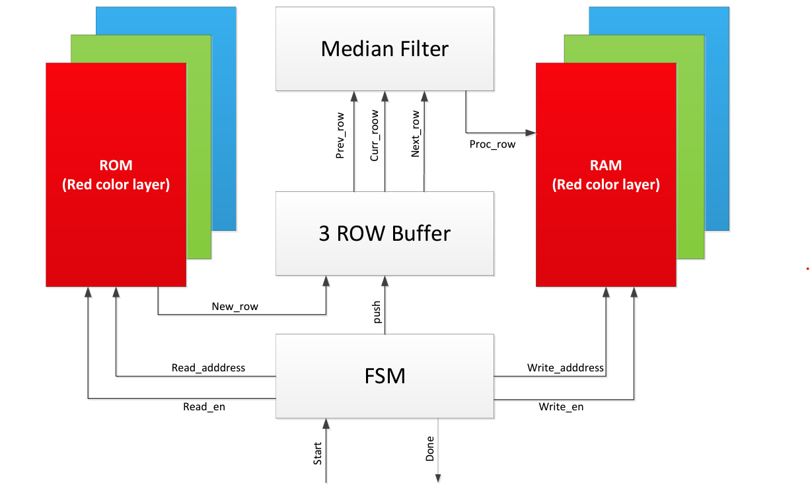
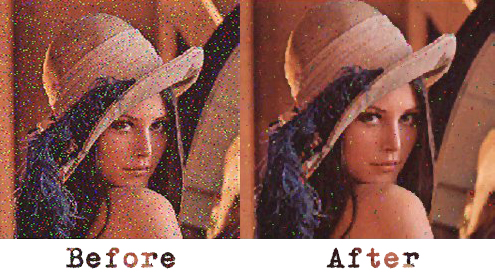

# Digital Filter System for Image Processing: Final lab project in Advanced Hardware Design and VHDL.

## Project Overview
This project focuses on designing a digital filter system that serves as a median filter. The primary objective is to process an image stored in RAM to remove noise and enhance its quality. The general system structure is depicted in Figure 1.

## Key Tasks
1. **Memory Configuration**: Create two types of memories, each having three copies for every color layer. This configuration is accomplished using the WIZARD-MEGA tool.
2. **Memory Access**: Enable access to all memories through the Editor Content Memory System.
3. **Auxiliary Files**: Utilize auxiliary files for the following purposes:
   - The `RAW2MIF` file takes a RAW image as input and generates three initialization files (*.mif) for the ROM memories. It follows color-based division while reducing depth.
   - The `img_proc` file includes essential data types and functions for implementing the filter for each color.
   - The `pp1_1` file simulates the median filter at a hardware level, emulating the proposed hardware solution. Run this simulation in MODELSIM using the provided LENA image with 5% salt-and-pepper noise.

## File Operations
- Running the `RAW2MIF` file results in a cleaned image in RAW format.
- Executing `MIF2RAW` retrieves the data from RAM memories via the Editor Content Memory System and saves them as .mif files.
- After running the MODELSIM simulation, you obtain the corrected image in .RAW format.

This project's primary goal is to design a digital filter system for image processing, with a focus on producing a denoised image from a noisy input using a median filter approach. The core tasks involve memory management, data types for image processing, and hardware-level simulation to validate the proposed solution.

## Project Details
In this project, we initiated the process by loading the Lena image, which had intentionally been corrupted with 5% salt-and-pepper noise. We subsequently applied a median filter to denoise the image. Below, you can find a visual representation illustrating the image both before and after the denoising process:

## Status
Archived, and I have no clue how to run it. 
